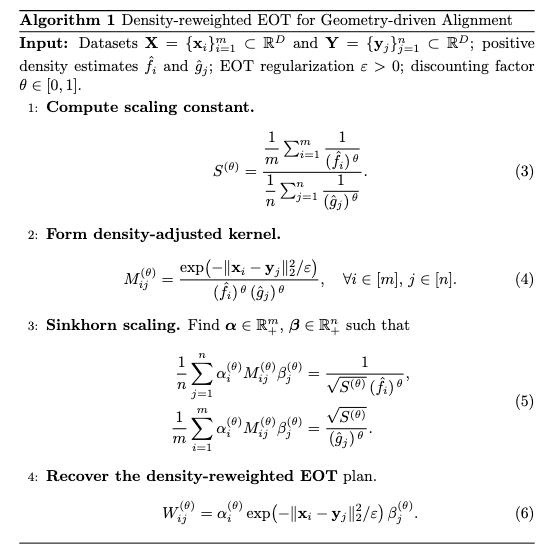

# DR-EOT — Density-Reweighted Entropic Optimal Transport

Code for the paper:

> **Density-Reweighted Entropic Optimal Transport: Decoupling Geometry from Sampling Density**  
> Keyi Li, Yuval Kluger, Boris Landa  
> Program of Applied & Computational Mathematics, Yale University  
> [arXiv:2608.16506](https://arxiv.org/abs/2608.16506)

---

## Problem

Standard EOT aligns datasets by minimizing transport cost subject to **uniform empirical marginals**. When two datasets share similar geometry but differ in sampling density, EOT matches points by relative density rather than geometric proximity — producing geometrically misleading correspondences.

**DR-EOT** addresses this by reweighting the kernel and marginals by the local sampling density, controlled by a parameter $\theta \in [0, 1]$:
- $\theta = 0$: standard EOT (density-sensitive)
- $\theta = 1$: geometry-driven alignment (density-discounted)
- Intermediate $\theta$: interpolation between the two regimes

## Installation

```bash
git clone https://github.com/Keyi-Li/DR-EOT.git
cd DR-EOT
pip install -e .

# For the UOT baseline in Figure 4:
pip install pot
```

**Dependencies:** numpy, scipy, scikit-learn, loguru, tqdm, matplotlib, pandas

## Reproducing Paper Figures

Each figure has a dedicated notebook in `notebooks/`:

| Notebook | Figure | Description |
|---|---|---|
| `fig1_demo_mismatch.ipynb` | Fig 1 | Standard EOT vs DR-EOT on line+curve example |
| `fig2_theta_sweep.ipynb` | Fig 2 | Effect of varying θ ∈ {0, 1/3, 2/3, 1} |
| `fig3_convergence.ipynb` | Fig 3 | Empirical convergence rate of DR-EOT |
| `fig4_simulation.ipynb` | Fig 4 | Benchmark vs UOT on arc manifolds |
| `demo.ipynb` | — | Quick-start demo (smaller data, all steps) |

Run from the `notebooks/` directory:

```bash
cd notebooks
jupyter notebook fig1_demo_mismatch.ipynb
```

> **Note:** Figure 4 (`fig4_simulation.ipynb`) is compute-intensive (≈hours for 10 replicates). Set `N_SIMS = 1` for a quick sanity check.

## Package Structure

```
dreot/
├── sinkhorn.py      # Core algorithm: sinkhorn_eot, sinkhorn_dreot
├── kde.py           # Bootstrap-Lepski KDE: GlobalBootstrapLepski
├── models.py        # Data-generating models: Arc, Manifold, WrappedGaussianMixture
└── utils/
    ├── bandwidth.py # knn_median, self_normalized_kde
    ├── bd_search.py # golden_bandwidth_mnn (ε selection via MKNN)
    ├── evaluation.py # knn_intersection, knn_celltype, ...
    ├── mknn.py      # find_mutual_knn, pct_mknn, ...
    └── plotting.py  # highlight_minmax, plot_pct_mknn, ...
```

## Algorithm



## Citation

```bibtex
@misc{li2026dreot,
  title={Density-Reweighted Entropic Optimal Transport: Decoupling Geometry from Sampling Density},
  author={Li, Keyi and Kluger, Yuval and Landa, Boris},
  year={2026},
  eprint={2608.16506},
  archivePrefix={arXiv},
  primaryClass={stat.ML},
  url={https://arxiv.org/abs/2608.16506}
}
```
